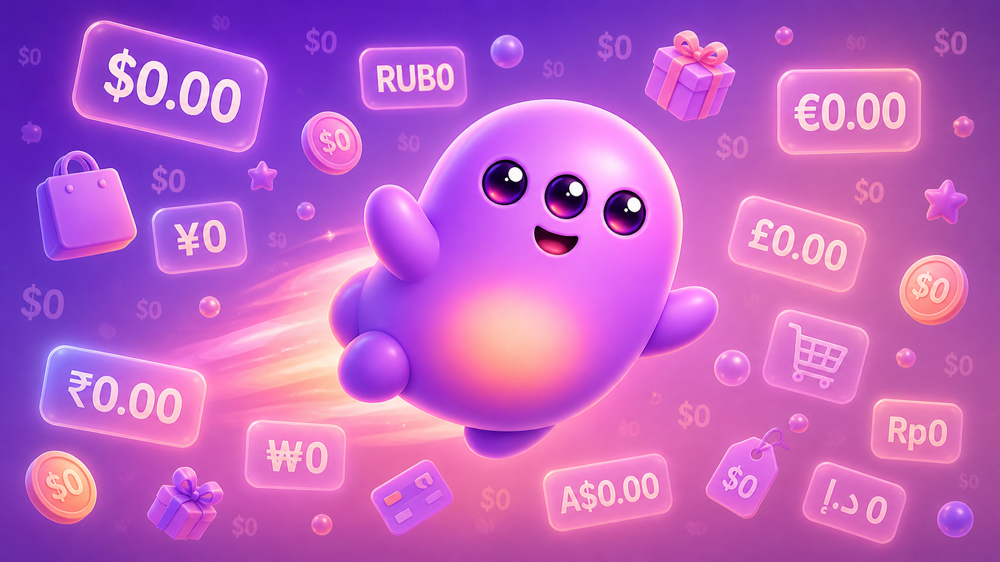

  

<h1 align="center">Zero Balance</h1>

<strong>Spend leftover Apple Account balance, in under a minute.</strong>

  <a href="https://zerobalance.pro/">zerobalance.pro</a>
  &nbsp;&middot;&nbsp;
  <a href="https://apps.apple.com/app/apple-store/id6761912988">App Store</a>

---

## The problem

Apple Account balance (also called App Store credit, iTunes credit, or gift card balance) is store credit, not money. Apple does not refund it to cash and will not let you change your App Store country while any balance remains. Three situations where the leftover starts to matter:

- **You want to change your Apple ID country or region.** Apple disables the change-country button in Settings until your balance is exactly $0.00.
- **You received a gift card.** The face value rarely lines up with any single app or subscription price, so a small remainder stays stuck after each purchase.
- **A subscription left a residue.** Pro-rated charges and currency rounding leave odd amounts like $0.47 or EUR0.79 - too small to buy anything on its own.

Most App Store apps are priced at round numbers ($0.99, $1.99, $4.99), and Apple subscriptions are billed in whole units. So a leftover under a dollar usually has no clean target.

## What Zero Balance does

Zero Balance is a free iOS app that picks the closest pack of small App Store items to clear your remaining balance to exactly zero. You enter the amount, the app proposes a plan built from eight in-app price tiers, shows you the total and the overage (often a few cents) before any purchase, and walks you through Apple's normal confirmation flow.

No subscriptions. No ads. No tracking. No access to your Apple ID. The app never reads your balance automatically because Apple does not expose that to third-party apps. Built for iOS 26 or later. Inventory and purchase history sync through CloudKit into your own private iCloud container.

---

## English

Long-form guides, each tuned to a specific real-world scenario:

- [How to spend leftover Apple Account balance](https://zerobalance.pro/en/spend-apple-account-balance/) - why Apple will not cash out store credit, the three ways people try to clear it, and which actually work.
- [How to change Apple ID country with a balance left](https://zerobalance.pro/en/change-apple-id-country-with-balance/) - the full pre-flight checklist: cancel subscriptions, wind down Apple One, spend the balance, wait for pending purchases, then switch country.
- [How to remove leftover Apple ID balance](https://zerobalance.pro/en/remove-leftover-apple-id-balance/) - what to do when a few cents are stuck and no standard subscription matches. Includes a worked example for a $0.47 leftover.

Hubs:

- [Frequently asked questions](https://zerobalance.pro/en/faq/)
- [Step-by-step help guide](https://zerobalance.pro/en/help/)
- [Privacy policy](https://zerobalance.pro/en/privacy/)
- [Support](https://zerobalance.pro/en/support/)

Individual FAQ entries, each with its own URL so you can deep-link to the exact answer:

- [Does Zero Balance read my Apple Account balance automatically?](https://zerobalance.pro/en/faq/does-zero-balance-read-my-balance/)
- [Will this drain my real money or just my store credit?](https://zerobalance.pro/en/faq/real-money-or-store-credit/)
- [What if my balance is smaller than the cheapest in-app item?](https://zerobalance.pro/en/faq/balance-smaller-than-cheapest-item/)
- [Why are there so many small in-app items?](https://zerobalance.pro/en/faq/why-many-small-items/)
- [Do I keep what I buy?](https://zerobalance.pro/en/faq/do-i-keep-what-i-buy/)
- [Where is my inventory stored?](https://zerobalance.pro/en/faq/where-is-my-inventory-stored/)
- [Are there subscriptions?](https://zerobalance.pro/en/faq/are-there-subscriptions/)
- [Can I get a refund?](https://zerobalance.pro/en/faq/can-i-get-a-refund/)
- [Does Zero Balance track me or run ads?](https://zerobalance.pro/en/faq/does-zero-balance-track-me/)
- [I want to switch my Apple ID country. Will this help?](https://zerobalance.pro/en/faq/help-with-changing-apple-id-country/)

---

## Русский

Подробные гайды под конкретные сценарии:

- [Как потратить остаток баланса Apple Account](https://zerobalance.pro/ru/spend-apple-account-balance/) - почему Apple не возвращает баланс деньгами и как обнулить остаток без подписок и без потери времени.
- [Как сменить страну Apple ID, если на балансе остались деньги](https://zerobalance.pro/ru/change-apple-id-country-with-balance/) - чек-лист: отмена подписок, ожидание возвратов, обнуление баланса, смена страны.
- [Как убрать остаток баланса Apple ID](https://zerobalance.pro/ru/remove-leftover-apple-id-balance/) - что делать, когда застряли несколько копеек, и пример на $0.47.

Хабы:

- [Частые вопросы](https://zerobalance.pro/ru/faq/)
- [Пошаговая инструкция](https://zerobalance.pro/ru/help/)
- [Политика конфиденциальности](https://zerobalance.pro/ru/privacy/)
- [Поддержка](https://zerobalance.pro/ru/support/)

Отдельные вопросы и ответы, каждый со своей ссылкой:

- [Zero Balance читает мой баланс Apple Account автоматически?](https://zerobalance.pro/ru/faq/does-zero-balance-read-my-balance/)
- [Это потратит мои деньги или только кредит магазина?](https://zerobalance.pro/ru/faq/real-money-or-store-credit/)
- [Что если мой баланс меньше самого дешёвого товара в приложении?](https://zerobalance.pro/ru/faq/balance-smaller-than-cheapest-item/)
- [Почему столько мелких товаров в приложении?](https://zerobalance.pro/ru/faq/why-many-small-items/)
- [Я оставляю себе то, что купил?](https://zerobalance.pro/ru/faq/do-i-keep-what-i-buy/)
- [Где хранится мой инвентарь?](https://zerobalance.pro/ru/faq/where-is-my-inventory-stored/)
- [Есть подписки?](https://zerobalance.pro/ru/faq/are-there-subscriptions/)
- [Можно вернуть деньги?](https://zerobalance.pro/ru/faq/can-i-get-a-refund/)
- [Zero Balance меня отслеживает или показывает рекламу?](https://zerobalance.pro/ru/faq/does-zero-balance-track-me/)
- [Я хочу сменить страну Apple ID. Это поможет?](https://zerobalance.pro/ru/faq/help-with-changing-apple-id-country/)

---

## About the developer

Zero Balance is built by Daniel Pustotin, an independent iOS developer. The app is free, has no subscriptions, and exists to solve one specific irritation that Apple has not solved itself. For anything else, see the support pages linked above.
